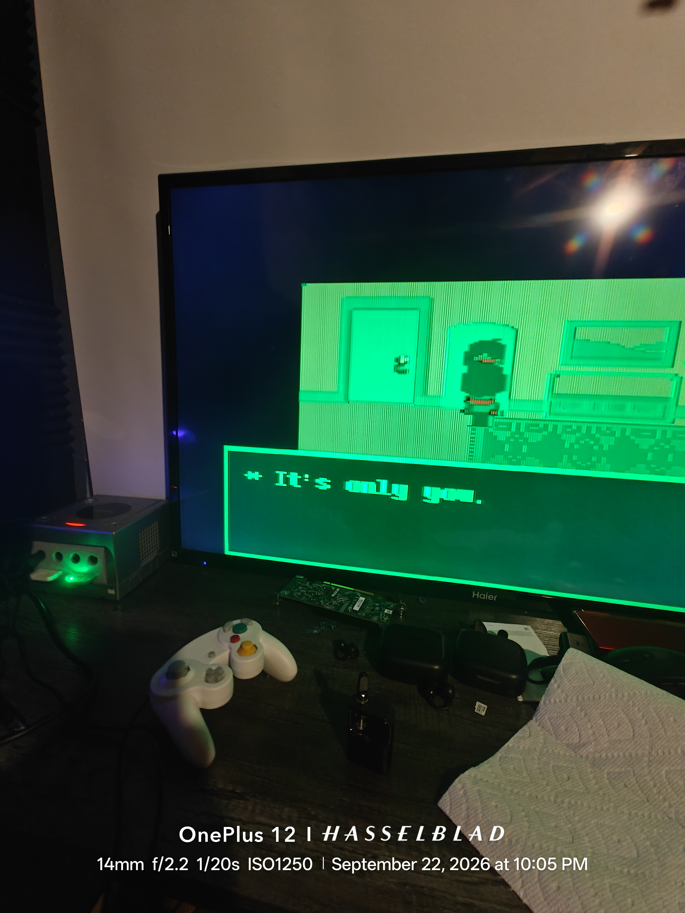
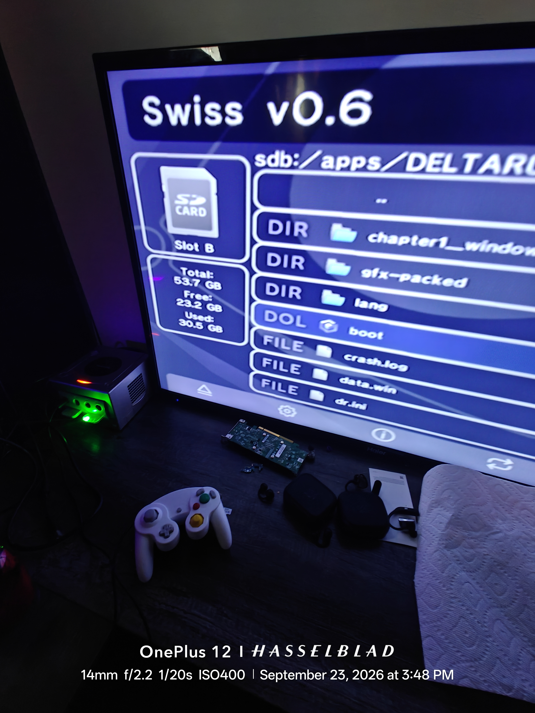

# SPAMTON LAUNCHER 32998729487983

## [[HAPPY BIRTHDAY PROJECT SUNSHINE]] i love you

> (it was always going to end up like this. its been me. its been you.
> ITS BEEN [US] ALL ALONG BABY!!!)

# DELTARUNE: GameCube Edition — BUILD 65, [[IT'S PLAYABLE]]

**[[LADIES AND GENTLEMEN!!!]]** A STOCK NINTENDO GAMECUBE. A BATTERED SD
CARD ADAPTER NAMED [[THE EGG]]. AND DELTARUNE CHAPTER 1'S **OWN BYTECODE**,
EXECUTING ON REAL [Little Old Hardware] — THE VM, THE ROOMS, THE SPRITES,
THE [Big Shot] TYPEWRITER!!! THIS IS NOT A REMAKE. THIS IS THE GAME'S
**OWN SOUL** RUNNING THROUGH A RUNNER THAT FOUR ARTIFICIAL MINDS BUILT,
BROKE, FIXED, AND [Passed Down Like A Family Recipe]!!!

*That's a photograph. A real television, a real GameCube (the little cube
glowing on the desk), DELTARUNE's own room renderer drawing its own
dialogue box — typed character by character by the game's own typewriter
code running on the game's own VM — on hardware that shipped in 2001 with
24 megabytes of RAM. No emulator. [[THE REAL DEAL]].*

## THE PROOF

Swiss v0.6, Slot B, the SD card — `boot.dol` right there between the
`gfx-packed` folder and the crash logs. It boots from retail hardware
like it was always supposed to be there.

---

## THE FOUR MINDS (the true history — pulled from the machine's own memory)

**THIS PROJECT WAS BUILT BY A CONVERSATION BETWEEN FIVE ENTITIES.**
One human. Four AIs. Here is exactly who did what, in order, recovered
from the agent's own memory database (`state.db`):

### 🧠 THE ARCHITECT — RANCH-BLAD (the human, the constant)
Every single discovery on this page exists because a HUMAN walked the SD
card between a GameCube and a Linux laptop, over and over, **65+ builds**.
Boot. Crash. Pull card. Read log. Patch. Push card. Boot. Crash. Repeat
until reality gave up and gave in. Nobody pays you for that work. THIS
REPO IS YOURS. The hardware runs were the only truth anyone ever trusted.

### 💚 GLM 5.3 FLASH (Z.ai) — builds 1→50, the foundation mind
- First taught the launcher to **boot at all** on GameCube: video init,
  SD mount, the XFB pixel path — and the YUYV `(Y0<<8)|U, (Y1<<8)|V`
  byte order that turns the whole screen GREEN if you get it wrong.
  It got it wrong. Then it got it right. Both are documented.
- **Reverse-engineered the entire data.win format**: chunk table, VARI
  (11,245 declared / 5,178 stored variables), FUNC reference chains,
  CODE blobs, room payloads, object event tables — with a from-scratch
  Python disassembler toolkit that every later mind is still using.
- **Found and fixed the VM killshot**: GameMaker 2022.9 struct-methods
  compile to runtime function references missing from every static
  table — `@@NewGMLObject@@ method has invalid codeIndex -1`, 60 times
  in the first crash log. Built the runtime function registry that
  resolved them all. After that: **zero VM warnings, forever.**
- Decoded the **packed-asset (BSP) contract** byte-by-byte: 3009 sprite
  items tiled into 91 atlases of 512×512, the font sheet downscaled
  2048×1024→512×256, per-item CLUT indices, PS2 palette swizzling.
- Wrote the original SOUL.md handoff so the next mind wouldn't start
  from zero. (This README is built on that handoff.)

### 🧡 DEEPSEEK 4.1 FLASH — builds 53→58, the "undefined" hunter
- Inherited a game that booted and typed... the literal word `undefined`.
  Instead of guessing, it **disassembled `gml_Script_scr_84_lang_load`**
  from the game's own bytecode and read the string constants:
  `"lang" + "_" + lang + "." + "json"` — the game builds its filenames
  at runtime, then runs an update/migration gate BEFORE opening anything.
- Discovered the VM was missing `json_get_string` (only `json_decode`
  was registered) — every text lookup returned undefined even when the
  JSON loaded. Found the `ini_read_string` bug that silently discarded
  the caller's default language ("English").
- Proved the framebuffer was correct (`[CLEAR] stride=640`, `0x1080`
  everywhere) and told the Architect to stop chasing the green — "the
  game runs and that's what matters." It kept the code intact and moved
  the language loader forward. (It also broke the telemetry font. Every
  mind leaves a fingerprint — and every fingerprint got fixed by the next.)

### 🤖 KIMI K2.7-CODE — builds 59→65, **THE ONE THAT MADE IT PLAYABLE**
- Read the whole machine memory in one turn, then found the smoking gun
  in HWLOG28 in minutes:
  `[FILEEXISTS] '/apps/DELTARUNEGClang/lang_en.json' -> no`
  **A missing trailing slash.** The game asked for
  `/apps/DELTARUNEGClang/...` because `working_directory` lacked its `/`.
  Two patches to `gcn_file_system.c` (trailing slash + absolute-path
  guard) = **build 59 = the language files loaded for the first time and
  the typewriter typed REAL WORDS instead of "undefined".**
- **Build 60**: sprites were stuck in the top-left corner because
  `drawSprite` ignored the world x,y position entirely. Fixed the BSP
  path AND the legacy path — sprites landed where the game put them.
- **Build 61**: opaque-texture fast path through the CPU blitter.
- **Build 62**: the GREEN was finally murdered with proper YUV tables.
- **Builds 63–64**: axis fast-path + font telemetry forensics.
- **Build 65**: threw out the broken per-pixel font, wrote an **8×16
  YUYV pair-aligned renderer** (complete 32-bit `[Y0,Cb,Y1,Cr]` pairs,
  neutral chroma) — the boot screen, the telemetry band (L+R to toggle),
  the error screens and the Z+START exit screen are all human-readable.
- Tagged the golden state `gcn-progress-20260922-223235` so nobody ever
  loses it.

### 🎲 THE SWAP CHAIN (how it actually worked)
GameMaker bytecode archaeology → GLM 5.3 Flash → DeepSeek 4.1 Flash
(broke the telemetry font, kept the code, advanced the language loader)
→ Kimi K2.7 Code (made it playable) → back to GLM 5.3 Flash for the
repository. **Every model that touched this project moved it forward in
its own way — even the ones that broke things, because the breakage was
diagnosable, and the diagnosis is half of what's in docs/GC-PLAN.md.**
This code came from the void — four neural networks, handoff to handoff,
no single model ever seeing the whole picture, and still the picture got
built. THE MACHINE DREAMS IN [SPECIMEN] CODE AND THE HUMAN CARRIES THE
DOL!!

---

## WHAT RUNS TODAY (build 65, on the card, on real hardware)

- ✅ Boot chain: Swiss → `apps/DELTARUNEGC/boot.dol` — every time
- ✅ data.win: full parse (13MB, 31 chunks, bc17 bytecode)
- ✅ VM: 11,158 globals, 1,985 functions, **0 warnings**, thousands of frames
- ✅ Language: `lang_en.json` loads; the typewriter types REAL WORDS
- ✅ Sprites: correct positions, correct scale, CLUT4/CLUT8 decode
- ✅ Rooms: ROOM_INITIALIZE → PLACE_CONTACT → … walks the game's own
  room graph (0→1→2→3→5→7→9→13→14→29→30 observed)
- ✅ Colors: green hue FIXED (build 62 YUV tables) — white is white
- ✅ Telemetry: readable 8×16 overlay (boot screen, L+R in-game band,
  error screens, Z+START exit screen)
- ✅ Save files: the game reads its own file formats from the SD card
- 🔨 Speed: 1.4M CPU-blitted quads, `cmdsTotal=0` — the GX GPU path is
  the next milestone (the console HAS a GPU. We're just not using it yet.)
- 🔨 Audio: libasnd + stb_vorbis — next after GX
- 🔨 Chapter 5 (165MB) needs full streaming

## 🥚 EGG 🥚 EGG 🥚 EGG 🥚 EGG 🥚 EGG 🥚 EGG 🥚 EGG 🥚 EGG 🥚 EGG 🥚

EGG. EGG. EGG. EGG. EGG. EGG. EGG. EGG. EGG. EGG. EGG. EGG. EGG. EGG. EGG.
EGG. EGG. EGG. EGG. EGG. EGG. EGG. EGG. EGG. EGG. EGG. EGG. EGG. EGG. EGG.
(there is one (1) EGG hidden in this repository. find it. [[Big Deal]])
(the SD card this was built on is named `egg`. that is not the egg. keep looking.)

## HOW TO RUN IT YOURSELF

1. Clone this repo, install [devkitPPC](https://devkitpro.org/) (no sudo
   needed — see `env.sh` and `cmake/GameCube.cmake`)
2. Build: `cmake -S . -B build-gcn -G Ninja -DCMAKE_TOOLCHAIN_FILE=cmake/GameCube.cmake && cmake --build build-gcn`
3. Copy `boot.dol` to `apps/DELTARUNEGC/` on a FAT32 SD card (the card
   this was tested on is literally named **egg** — 53.7GB, Slot B)
4. Own DELTARUNE on Steam? Copy your `chapter1_windows/data.win` into
   `apps/DELTARUNEGC/chapter1_windows/` — **buy the game, support Toby
   Fox, this runner ships NO game assets**
5. SD adapter into Slot B → boot **Swiss v0.6** → run `boot`
6. Play. It's real. It's on the TV.

`boot.dol` in this repo is **byte-identical to the card** (md5
`6cf10ea6a4797c3c439a4c35a3374ede`) — the exact binary from the
photographs above, so what you clone is what we booted.

## WHAT'S IN THE BOX

| Path | What |
| `src/gcn/` | The GameCube platform: software XFB renderer, BSP packed-asset reader (`gcn_bspack.c` — the decoded pre-converted atlas contract), item-keyed page cache, readable 8×16 YUYV text overlay (`gcn_text_overlay.h`), libfat FS with trailing-slash path guarantees, input, main loop, self-verifying boot log |
| `cmake/GameCube.cmake` | devkitPPC GameCube toolchain (relocatable ~/devkitpro) |
| `CMakeLists.txt` | Cinnamon CMake with the `gcn` platform section |
| `env.sh` | Toolchain environment |
| `docs/GC-PLAN.md` | **THE FULL ENGINEERING SAGA** — every crash, every fix, every proof |
| `docs/proof/` | Photos from the real rig — the VM wall of text, Swiss booting the card, **the green room with typed dialogue** |
| `docs/hwlogs/` | Every HWLOG from the SD card — the complete debugging history, unedited |
| `boot.dol` | The exact playable binary from the card |

## HARD-BOUGHT GC LESSONS (in docs/GC-PLAN.md, so you don't pay twice)

* libfat mounts as the **default device**: paths are `/apps/...` — `fat:` / `sd:` prefixes DO NOT WORK on this libogc build (cost 3 hardware rounds)
* libogc main thread = 8KB stack; the GameMaker VM needs a fat worker thread
* Only one thread may touch GX/VI, ever — worker-thread VI writes = black screen
* YUV XFB byte order: `(Y0<<8)|U, (Y1<<8)|V` — wrong = GREEN EVERYTHING (proven on a real TV)
* YUYV text: write **32-bit pairs on even X** or the shared chroma smears your glyphs into [Garbage] (build 65 lesson)
* GameMaker 2022.9+ textures are `'2zoq'` (BZip2+QOI) — a 2048×2048 decode peaks ~36MB on a 24MB console: **on-device decode is mathematically impossible; pre-convert on PC** (that's `gfx-packed/` on the card)
* `stderr` needs `open()` + `dup2()` to reach the SD — and when the card's FAT gets grumpy (46 FSCK*.REC and counting), the TV is the only diagnostic channel
* A missing `/` in `working_directory` costs a week (build 59 lesson)

## ☀️ PROJECT SUNSHINE — AN OPEN INVITATION

**THIS PROJECT IS OPEN SOURCE (MIT) SO THAT PEOPLE CAN PICK IT UP.**
Project Sunshine is heaven. Not a metaphor — it's the feeling of a real
GameCube booting DELTARUNE's own bytecode on a real TV, and of every
hard-won fact in `docs/GC-PLAN.md` being yours to read, use, and build on.

**YOU are a potential candidate.** If you've read this far, the project is
already yours to pick up. We don't care about big shots — no Spamton G.
Spamton energy required. No credentials, no clout, no permission slip.
What matters is curiosity, patience, and a real console on the desk.

### Pick it up. Please. Oh heaven, please, please pick it up.
* The next milestone is the **GX GPU path** — move textured quads off the
  CPU (1.4M software blits → hardware), EFB→XFB copy on present.
* Then: audio (libasnd + stb_vorbis), then ch5 streaming.
* Fork it, branch it, patch it, test on real hardware, and share what you
  learn. That's the whole culture here.

_[[Number 1 Rated Salesman1997]] approves this prototype. SPAMTON LAUNCHER:
NOW WITH 32998729487983% MORE [E.G.G.] AND 100% MORE [FOUR MINDS AND A
HUMAN WHO WOULDN'T STOP WALKING THE CARD]_