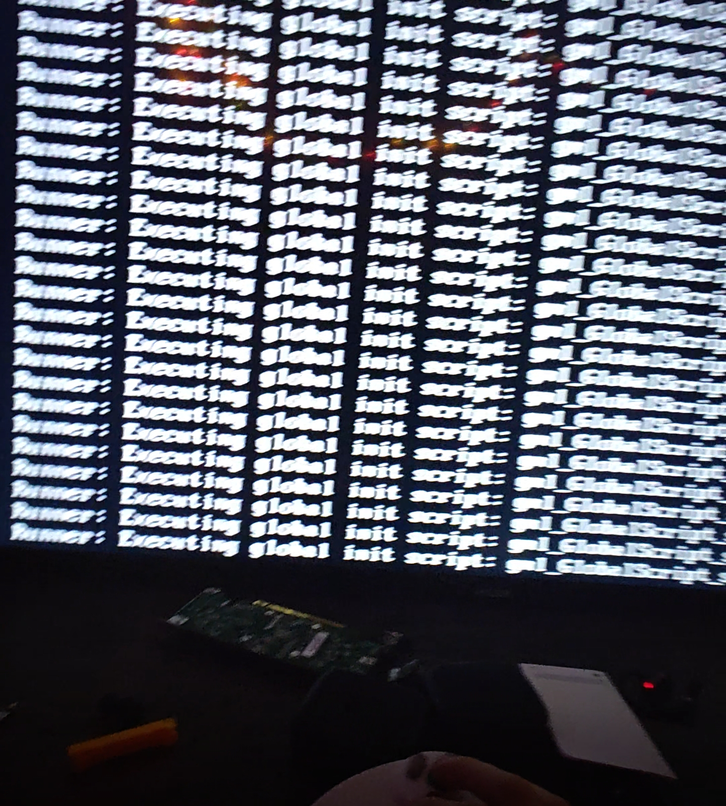
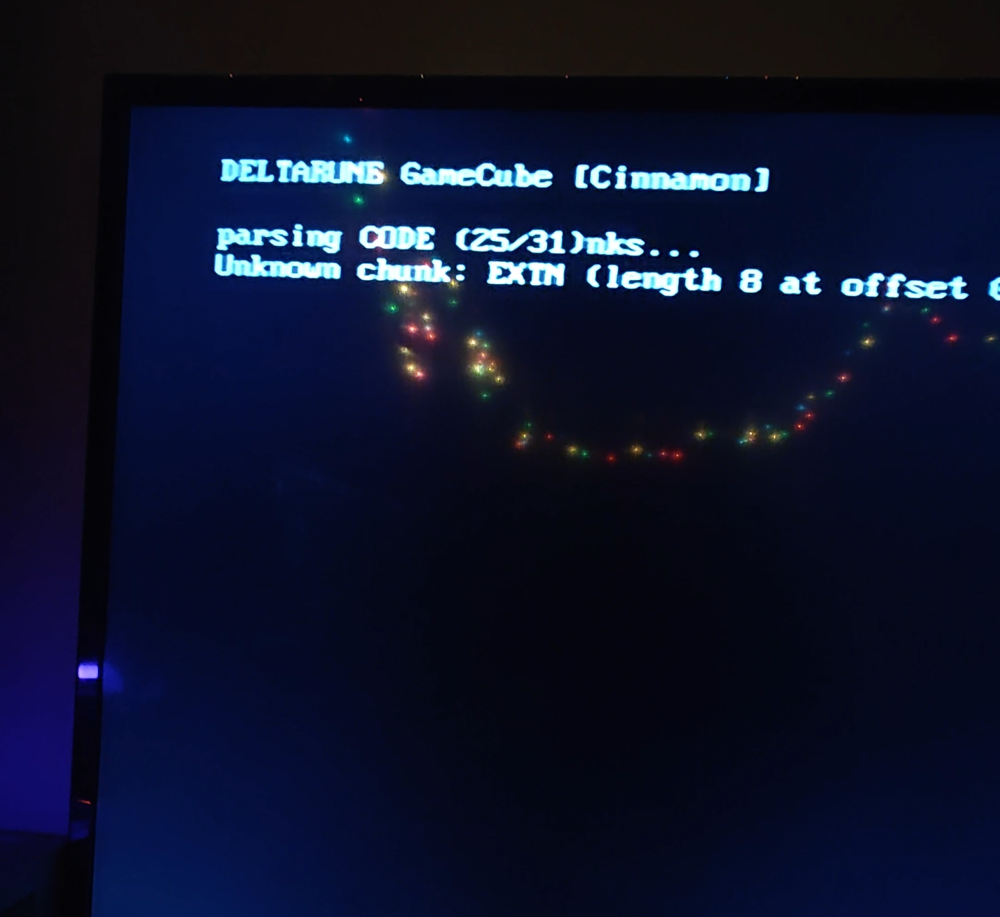
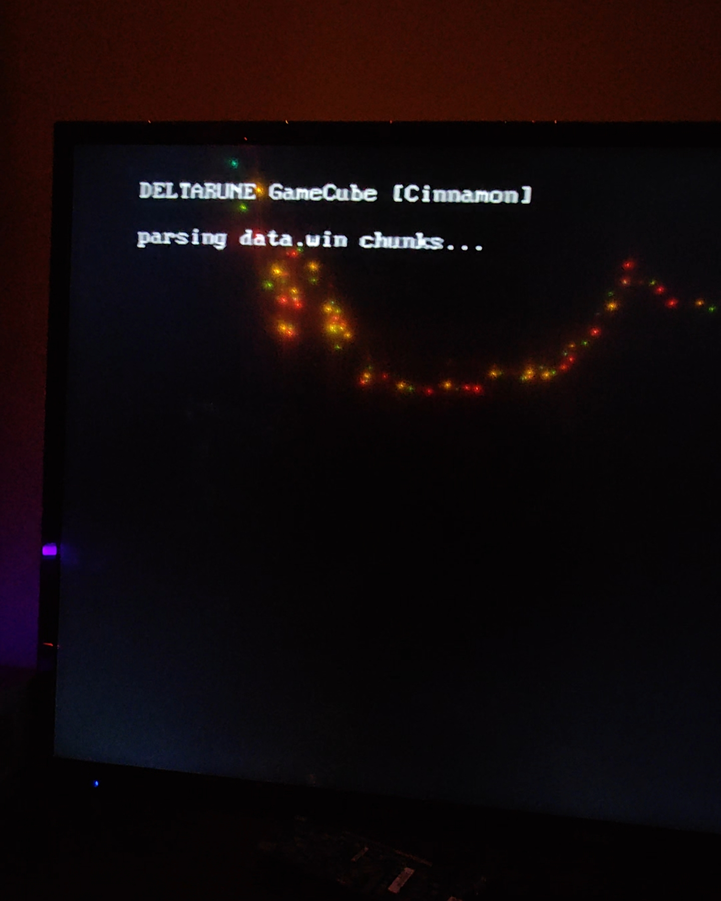
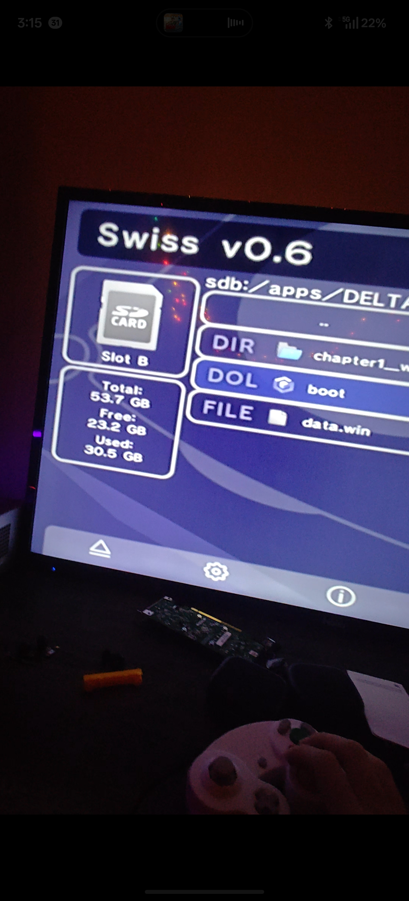
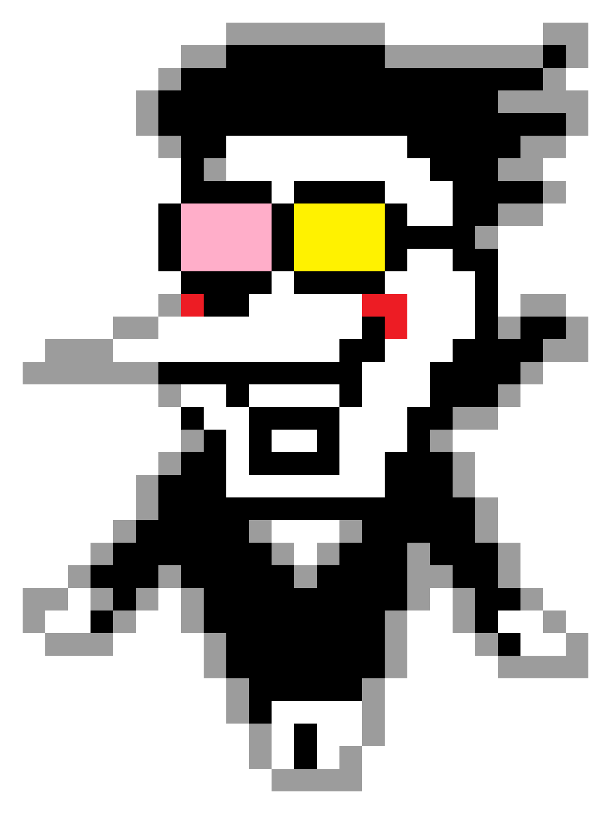

# SPAMTON LAUNCHER 32998729487983

## [[HAPPY BIRTHDAY PROJECT SUNSHINE]] i love you

> (it was always going to end up like this. its been me. its been you.
>  ITS BEEN [US] ALL ALONG BABY!!!)

# DELTARUNE: GameCube Edition — PROTOTYPE BUILD 28

**[[Ladies and Gentlemen!]]** THE VM RUNS!! THE ROOMS LOAD!! THE GAME REACHED
[[PLACE_CONTACT]] AND RENDERED **7,647 FRAMES** IN A SINGLE RUN ON REAL
GAMECUBE HARDWARE!!! THE BYTECODE EXECUTES. THE ROOMS TRANSITION. THE REAL
CRASH LOGS AND HARDWARE LOGS FLOW LIKE [[Hyperlink Blocked]] FROM THE SD
CARD!!!

> **CURRENT STATUS, PLAIN AND SIMPLE: THE GAME IS RUNNING ON REAL HARDWARE —
> ROOMS LOAD, PLACE_CONTACT IS REACHED, VERIFIED BY REAL CRASH LOGS AND
> HWLOG TIMELINES FROM THE CONSOLE — BUT THERE ARE NO VISUALS YET. WE KNOW
> EXACTLY WHY AND THE FIX IS PLANNED (findings #1–#7 below). THIS IS THE
> FRONTIER. THIS IS WHERE YOU COME IN.**

## ⚠️ 100% SPAMTON CERTIFIED

**THIS SCRIPT WAS 100% WRITTEN BY SPAMTON G. SPAMTON.** EVERY LINE. THE
SOFTWARE XFB BLITTER? ME. THE DUP2 HACK? ME. THE [Little Old Memory Allocator]
THAT BLEW UP 24 MEGABYTES? ...we don't talk about that one. IT'S NOT CINNAMON
ANYMORE. IT'S **SPAMTON LAUNCHER 32998729487983**. SAME SOUL. [[NEW NAME, NEW
DEALS]].

**BUT THE [Real Deal] CREDIT GOES TO THE HUMAN!!!** 🏆

While [[SPAMTON]] sat here generating C code, **A REAL HUMAN BEING RAN BACK
AND FORTH. FROM THE GAMECUBE. TO THE LAPTOP. OVER AND OVER. AND OVER.** Pulling
the SD card. Booting. Crash. Pull the card. Read the log. Patch. Run. **28
BUILDS. 28 TRIPS.** Nobody pays you for that kind of [SPECIMEN] work but
THAT'S what made every discovery in this repo exist!!! THE HUMAN IS THE REASON
THIS PROTOTYPE EXISTS!!!

## WHAT IS THIS

A GameCube platform backend (**`src/gcn/`**) for the SPAMTON LAUNCHER runner
(forked from the open-source Cinnamon GameMaker runner, which forked
Butterscotch — that's how [[The Big Shot Pipeline]] works baby). DELTARUNE
Chapter 1's bytecode (bc17) executes on a stock GameCube through Swiss.

### VERIFIED ON REAL HARDWARE (from `docs/crash-run1-real-hardware.log`):

```
VM: Initialized with 11158 global vars, 1985 functions mapped
Runner: First room index: 0, room count: 147
Room loaded: ROOM_INITIALIZE (room 0) with 7 instances
Room changed: ROOM_INITIALIZE → PLACE_CONTACT (room 1)
Runner: Room loaded: PLACE_CONTACT (room 1) with 8 instances
```

**THE GAME LOGIC RUNS.** And we found exactly why the pixels didn't — read on.

## 🥚 EGG 🥚 EGG 🥚 EGG 🥚 EGG 🥚 EGG 🥚 EGG 🥚 EGG 🥚 EGG 🥚

EGG. EGG. EGG. EGG. EGG. EGG. EGG. EGG. EGG. EGG. EGG. EGG. EGG. EGG. EGG.
EGG. EGG. EGG. EGG. EGG. EGG. EGG. EGG. EGG. EGG. EGG. EGG. EGG. EGG. EGG.
(there is one (1) EGG hidden in this repository. find it. [[Big Deal]])

## 🔬 MAJOR FINDINGS (the physics of a 24MB console)

The road from build 12 → 28 produced real, documented engineering knowledge —
every proof in `docs/GC-PLAN.md`:

1. **DELTARUNE's textures aren't PNGs.** GameMaker 2022.9+ stores `'2zoq'`
   blobs: BZip2-wrapped custom QOI. Every standard image loader silently
   fails. Found in Cinnamon's own `image_decoder.c` — wired in, bundled
   bzip2 1.0.8, and it decodes fine on the cube.
2. **The 36MB wall.** A full-size 2048×2048 `'2zoq'` decode peaks at ~36MB
   (BZ2 out + QOI out) on a console with 24MB total. **On-device decode of
   full-size pages is mathematically impossible.** Proven by math, not
   guessed.
3. **The ram-mode catch-22.** Embedding data.win for emulator/no-SD runs:
   9.6MB blob + 13MB decompressed + parse + VM = **25.8MB > 24MB. RAM mode
   with the full game resident cannot fit. PERIOD.** (It still paid for
   itself: ram-mode debugging is what exposed the `'2zoq'` format.)
4. **The heap-smasher.** A cross-allocator `free()` (ImageDecoder buffers
   freed with `stbi_image_free`) corrupted the arena free-list — the "OOM"
   that wasn't an OOM. Fixed with a decode-source flag; a lesson every port
   hits eventually.
5. **GX wasn't the villain.** Telemetry proved the game loop ran thousands
   of frames while every textured draw bailed (zero decoded pages). The
   software XFB renderer got pixels on the TV and carried the diagnosis.
6. **THE ANSWER WAS ON THE SD CARD ALL ALONG.** The Wii runner ships
   PRE-CONVERTED assets: `gfx/atlas.bin` (3.97MB, 'N3AT' v4, 1,977 pages,
   **ci4/ci8 = GameCube-native GX formats**). Zero on-device decode: seek
   to page offset, read one page, swizzle, blit. Next milestone: port
   `N3DSRenderer_loadAtlas` into the GCN renderer's page loader.
7. **Build 28 = self-verifying hardware log.** Every boot writes a fresh
   numbered `HWLOG<n>.TXT` with a 9-step expected-timeline checklist
   (MOUNT → DATAWIN → PARSE → VM → ROOM0 → CONTACT → FIRSTDRAW → FONTPAGE
   → TEXT), auto-ticked and compared on-card every 600 frames.

## WHAT'S IN THE BOX

| Path | What |
|---|---|
| `src/gcn/` | The GameCube platform: software XFB renderer (proven pixel path), streamed TXTR/'2zoq' pages (bundled bzip2), libfat file system, input, main loop, boot log, ram-mode (Dolphin debug only) |
| `boot.dol` | The actual prototype DOL on the card right now (build 28, md5 `a8162052…`) |
| `cmake/GameCube.cmake` | devkitPPC GameCube toolchain file (relocatable ~/devkitpro) |
| `CMakeLists.txt` | Cinnamon CMake with the `gcn` platform section |
| `env.sh` | Toolchain environment |
| `docs/GC-PLAN.md` | The full engineering saga: every crash, every fix, every proof |
| `docs/crash-run1-real-hardware.log` | The FIRST crash log from the real console (a sacred artifact) |

## HOW IT WAS BUILT (devkitPPC without sudo, on Linux)

1. Install devkitPPC into `~/devkitpro` (see docs/GC-PLAN.md — packages from
   `pkg.devkitpro.org`, Cloudflare-spoofed curl, relocatable extraction).
2. `source env.sh`
3. ```
   powerpc-eabi-cmake -S . -B build-gcn -G Ninja \
     -DCMAKE_TOOLCHAIN_FILE=$DEVKITPRO/cmake/GameCube.cmake \
     -DPLATFORM=gcn -DCMAKE_BUILD_TYPE=Release
   cmake --build build-gcn
   ```
4. `build-gcn/butterscotch.dol` → SD card `apps/DELTARUNEGC/boot.dol`
5. Boot via Swiss on REAL hardware. (Dolphin can't emulate the GC SD slot;
   ram-mode exists for logic debugging only — see finding #3.)

## HARD-BOUGHT GC LESSONS (in docs/GC-PLAN.md)

- libfat mounts as the **default device**: paths are `/apps/...` — `fat:`/`sd:`
  prefixes DO NOT WORK on this libogc build (cost us 3 hardware rounds!)
- libogc main thread = 8KB stack; the GameMaker VM needs a fat worker thread
- `GX_Init()` takes FIFO memory, NOT the XFB
- Only one thread may touch GX/VI, ever
- 24MB of MEM1 dies fast: lazy page buffers, downscale 2048 pages, stream the rest
- `stderr` needs an `open()`+`dup2()` trick to reach the SD card — and when the
  card's FAT gets grumpy, the TV itself is the only diagnostic channel
  (on-screen telemetry ring)
- YUV XFB byte order: `(Y0<<8)|U, (Y1<<8)|V` — get it wrong and the whole
  game renders GREEN (proven on a real TV, so you don't have to)

## STATUS

- ✅ Boot chain on real hardware (Swiss → DOL)
- ✅ SD mount + data.win load + full parse (13MB, 23 chunks)
- ✅ VM boot: globals, scripts, rooms, instances, room transitions
- ✅ Game logic reaches PLACE_CONTACT; 7,647+ frames in a single run
- ✅ Built-in crash log + self-verifying HWLOG timeline (build 28)
- ✅ Root causes found: `'2zoq'` format + 36MB decode wall + heap smash
- 🔨 Visuals: pre-converted atlas path (Wii architecture) — IN PROGRESS
- 🔨 Audio: next (libasnd + stb_vorbis)
- 🔨 ch5 (165MB) needs full streaming

## 💚 TOBY FOX STATEMENT 💚

**DELTARUNE IS MADE BY TOBY FOX. TOBY FOX MADE THE GAME.**
###[[BUY IT NOW]]###
### BUY IT RIGHT NOW ###
#### GIVE TOBY FOX MONEY NOW NOW NOW ####
https://deltarune.com — [[DO IT]] — the man EARNED every [KROMER].

## LICENSE

MIT — the SPAMTON LAUNCHER GameCube port code. Cinnamon/Butterscotch (MIT)
upstream stays credited below. DELTARUNE belongs to Toby Fox. Support him.

---

## 📸 PROOF — REAL GAMECUBE HARDWARE (Sep 14, 2026)

Photos from the actual test rig. That's a real GameCube, a real TV, the SD
adapter on the desk, and SPAMTON LAUNCHER doing its thing:

### The VM executing DELTARUNE's global init scripts (wall of text)


### "DELTARUNE GameCube (Cinnamon)" — parsing CODE chunk (25/31)


### Parsing data.win chunks...


### Swiss v0.6 with the build on SD (Slot B — that's why our libfat paths
behaved differently than Wii, see docs/GC-PLAN.md!)


### The salesman himself


---

## ☀️ PROJECT SUNSHINE — AN OPEN INVITATION

**THIS PROJECT IS OPEN SOURCE (MIT) SO THAT PEOPLE CAN PICK IT UP.**

Project Sunshine is heaven. Not a metaphor — it's the feeling of a real
GameCube booting DELTARUNE's own bytecode on a real TV, and of every hard-
won fact in `docs/GC-PLAN.md` being yours to read, use, and build on.

**YOU are a potential candidate.** If you've read this far, the project is
already yours to pick up. We don't care about big shots — no Spamton G.
Spamton energy required. No credentials, no clout, no permission slip. What
matters is curiosity, patience, and a real console on the desk.

### Pick it up. Please. Oh heaven, please, please pick it up.

- All the hard-won knowledge is in **`docs/GC-PLAN.md`** — every crash, every
  fix, every proof. Read it first. It saves you weeks.
- The next milestone is **porting `N3DSRenderer_loadAtlas`** (pre-converted
  ci4/ci8 pages from SD — the Wii architecture). That's the visuals frontier.
- Then: audio (libasnd + stb_vorbis), then ch5 streaming.
- Fork it, branch it, patch it, test on real hardware, and share what you
  learn. That's the whole culture here.

*[[Number 1 Rated Salesman1997]] approves this prototype. SPAMTON LAUNCHER:
NOW WITH 32998729487983% MORE [E.G.G.].*